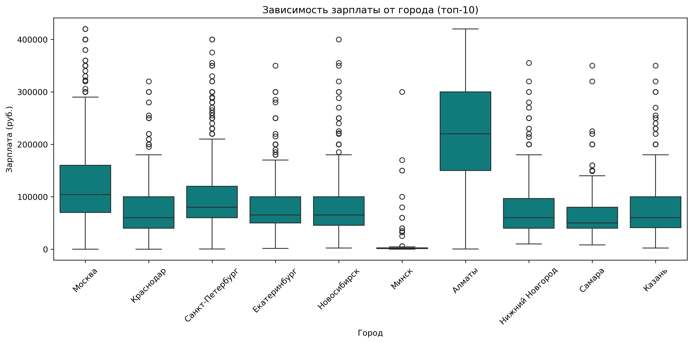
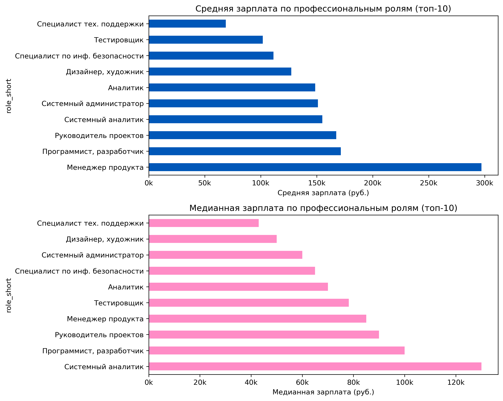
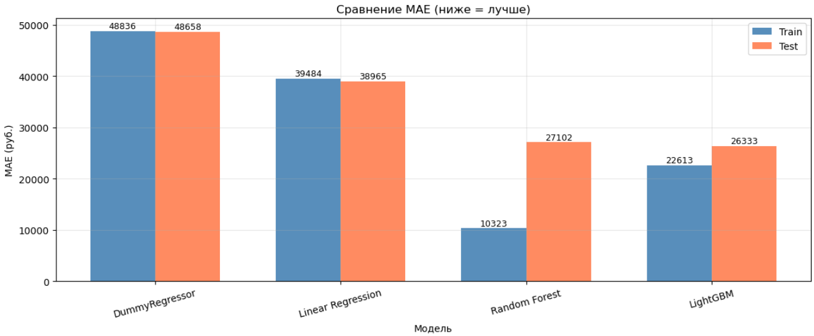
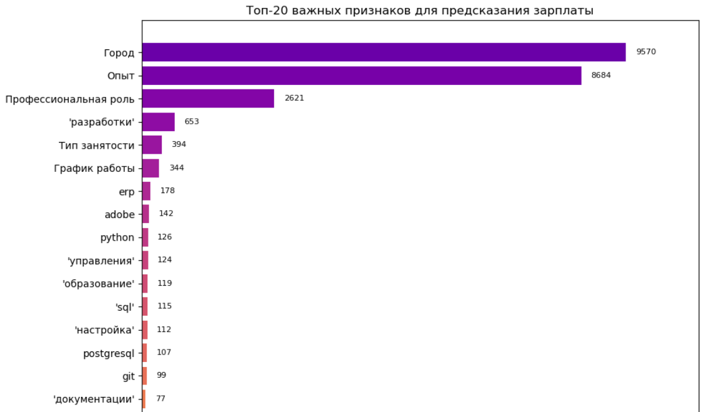

# Анализ IT-вакансий HeadHunter

Прогнозирование зарплат IT-специалистов на основе характеристик вакансий. Полный ML-пайплайн: EDA, обработка текстов, обучение и сравнение моделей, подбор гиперпараметров, кросс-валидация и исследование важности признаков.

## Бизнес-задача

Работодатели часто назначают зарплату субъективно, без точной привязки к рынку, а соискатели не всегда представляют актуальный диапазон для своих навыков. Это замедляет наём и снижает прозрачность рынка. Автоматическая оценка на основе реальных вакансий позволяет формировать конкурентное предложение, опираясь на данные, а не на интуицию.

Модель предсказывает уровень зарплаты IT-вакансии по её характеристикам: опыт, город, профессиональная роль, занятость, график, ключевые навыки и текстовое описание.

## Данные
Датасет [IT Vacancies from HeadHunter](https://www.kaggle.com/datasets/ilyazawilsiv/it-vacancies-from-headhunter-website) - 68 000 вакансий, собранных через публичное API HeadHunter по всей России (18.09.2023-17.10.2023). 

## Что сделано

- **EDA:** доля пропусков, распределение зарплат, опыта, городов и ролей, связь зарплаты с опытом и регионом
- **Предобработка:** удаление пропусков и выбросов, Label Encoding категорий, TF-IDF для навыков и описаний
- **Baseline:** DummyRegressor
- **Модели:** LinearRegression, RandomForest, LightGBM
- **Отбор признаков:** Permutation Importance
- **Подбор гиперпараметров:** RandomizedSearchCV
- **Кросс-валидация:** 5-fold
- **Интерпретация:** топ-20 значимых признаков с расшифровкой навыков и слов из описаний

#### Зарплата по городам

#### Зарплата по ролям

## Результаты

LightGBM (tuned) показал наилучший баланс - наивысший R² на тесте и минимальный разрыв между train и test, в отличие от переобученного Random Forest. Подбор гиперпараметров дал значимый прирост по всем метрикам. Модель уверенно предсказывает зарплату для большинства позиций.

#### Сравнение моделей

#### Ключевые факторы зарплаты

Наиболее значимые признаки:
- **Город** - главный фактор: разрыв между Москвой и регионами в 2-3 раза
- **Опыт** - зарплата растёт с повышением требований
- **Навыки:** Python, SQL, PostgreSQL, Git, ERP, Adobe - прямо коррелируют с зарплатой
- **Маркеры из описаний:** «разработки», «управления», «образование» - уровень ответственности

## Стек

`Python` `pandas` `NumPy` `scikit-learn` `LightGBM` `Matplotlib` `Seaborn` `TF-IDF` `RandomizedSearchCV` `Permutation Importance`

## Структура

- `salary_prediction.ipynb` - ноутбук с кодом и выводами
- `it_vacancies.csv` - датасет (скачать по ссылке выше и поместить в папку с ноутбуком)
